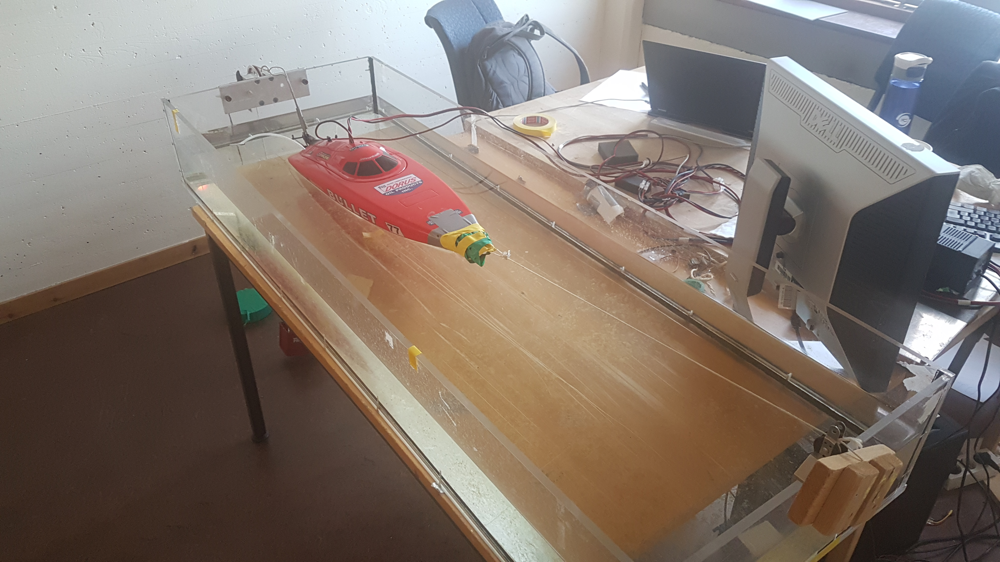

# TMR4345 - Marine Computer Science Lab Project

Dynamic Positioning Project for course TMR4345 Marine Computer Science Lab, Maritime Department (IMT) NTNU. Written spring 2020.

## Experimental set-up

Using Phidget servo interface, a small boat model in a basin is controlled using a PID-algorithm written in C. The boat position is measured using a Phidget potentiometer, whose voltage ratio is controlled to stabilize boat in desired position.

## Contents of this repository

The repository will contain the code used during the project, and Python code for post-processing of recorded data during experimental testing. To replicate the project, [Phidget drivers](https://www.phidgets.com/) and API will need to be downloaded and used alongside the provided code. 
